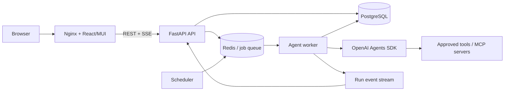

# LLM Chat Application — Implementation Plan

## 1. Goal

Build a web application that lets a user run an LLM-backed question immediately, on a schedule, or from future trigger types. Each run can select:

- an allowed model;
- a model-supported reasoning effort;
- an application execution mode (`single`, `judge`, or `jury`); and
- an approved set of tools and MCP servers.

The first release will provide a React/MUI chat experience, a FastAPI backend using the OpenAI Agents SDK, persistent conversations and runs, scheduled execution, streaming results, and containerized deployment with the frontend served by Nginx.

## 2. Working assumptions

These assumptions make the plan actionable, but should be confirmed before implementation:

- This is initially a multi-user web app with authentication and per-user data isolation.
- PostgreSQL is the system of record.
- Conversations, manual prompts, scheduled prompt definitions, every scheduled execution, and their responses are durably retained and retrievable until the user deletes them or the configured retention policy expires.
- Redis plus a separate worker process will handle queued and scheduled runs. The queue implementation will be selected during the foundation phase; it must support retries, delayed work, idempotency, and visibility into failed jobs.
- The backend owns the OpenAI API key. It is never sent to the browser or stored in chat records.
- Users select tools and MCP servers from an administrator-controlled registry. They cannot submit arbitrary code, commands, credentials, or MCP URLs in a run request.
- Model availability is controlled by a server-side allowlist and capability matrix, not hard-coded into the frontend.
- The OpenAI Responses API path used by the Agents SDK is the default integration path for reasoning, tool use, and multi-turn work.
- The initial trigger types are `manual` and `schedule`; the trigger interface will be extensible for webhooks and application events later.

## 3. Scope

### MVP

- Create, view, rename, and archive conversations.
- Search and revisit previous conversations, prompts, scheduled prompts, and responses.
- Submit prompts and stream run status/output to the browser.
- Select a model, supported reasoning effort, execution mode, tools, and MCP servers per run.
- Execute prompts immediately or through a saved schedule.
- Cancel queued or running work when the underlying provider/tool supports cancellation.
- Inspect run history, configuration, status, usage, timing, and errors.
- Retry failed runs without creating duplicate side effects.
- Provide capability APIs for models, reasoning efforts, execution modes, tools, MCP servers, and trigger types.
- Package frontend, API, and worker as Docker images; serve the built frontend through Nginx.

### Deferred unless required for MVP

- Arbitrary user-supplied MCP endpoints.
- File uploads and retrieval-augmented generation.
- Voice, image generation, and multimodal chat UI.
- Team sharing, billing, and organization administration.
- Trigger types beyond schedules, except for the extension contracts needed to add them safely.
- Native mobile applications.

## 4. Key terminology and behavior

Keep the following concepts separate in the API, database, and UI:

- **Execution mode**: application orchestration strategy: `single`, `judge`, or `jury`.
- **Reasoning effort**: model-level setting such as `none`, `low`, `medium`, or `high`; supported values depend on the selected model.
- **Trigger type**: why a run was created: `manual`, `schedule`, or a future trigger.
- **Tool**: an approved callable capability exposed to an agent.
- **MCP server**: an approved server whose filtered tools may be exposed to an agent.

Proposed execution-mode semantics (requires product confirmation):

1. **Single** — one configured agent execution returns the answer.
2. **Judge** — create one or more independent candidate answers, then run a separate judge that evaluates them against a rubric and returns the chosen or synthesized answer with a short verdict.
3. **Jury** — create multiple independent candidate answers, evaluate them with multiple jurors, aggregate their votes/scores, and use a final synthesizer to return the answer plus a concise consensus summary.

Judge and jury runs must have explicit limits for candidate count, juror count, parallelism, tokens, elapsed time, and cost. Prompts and tool results must be isolated between candidates unless the orchestration design intentionally shares them.

## 5. High-level architecture



### Components

- **Frontend**: React + TypeScript + MUI, built as static assets and served by Nginx. Nginx also proxies `/api` and the streaming endpoint to FastAPI.
- **API**: FastAPI application for authentication, validation, CRUD, capability discovery, run submission, cancellation, and event streaming.
- **Worker**: separate Python process that runs agent workflows outside request/response lifetimes.
- **Scheduler**: scans/claims due schedules or uses the chosen queue's scheduler, then enqueues idempotent run jobs.
- **Database**: PostgreSQL stores users, conversations, messages, immutable run configuration snapshots, schedules, trigger events, and audit records.
- **Queue**: Redis-backed queue separates interactive API traffic from potentially long LLM/tool work.
- **Provider layer**: an internal adapter around the OpenAI Agents SDK so provider calls, tracing, error mapping, and future provider changes do not leak into API routes.

## 6. Repository layout

```text
/
├── frontend/
│   ├── src/
│   │   ├── api/
│   │   │   ├── generated/
│   │   │   └── adapters/
│   │   ├── components/
│   │   ├── features/chat/
│   │   ├── features/runs/
│   │   ├── features/schedules/
│   │   └── theme/
│   ├── Dockerfile
│   └── nginx.conf
├── backend/
│   ├── app/
│   │   ├── api/
│   │   ├── auth/
│   │   ├── core/
│   │   ├── db/
│   │   ├── models/
│   │   ├── schemas/
│   │   ├── agents/
│   │   │   ├── orchestration/
│   │   │   ├── tools/
│   │   │   └── mcp/
│   │   ├── runs/
│   │   ├── schedules/
│   │   └── triggers/
│   ├── migrations/
│   ├── openapi/
│   │   └── openapi.json
│   ├── tests/
│   ├── pyproject.toml
│   ├── uv.lock
│   └── Dockerfile
├── compose.yaml
├── .env.example
└── Plan.md
```

Use `uv` for Python dependency locking, environment synchronization, running commands, and container installs. Commit both `pyproject.toml` and `uv.lock`; CI and production builds must use locked dependencies.

## 7. Domain model

Use UUIDs, UTC timestamps, and database migrations from the beginning.

- **User**: identity, status, roles, preferences, budget/limit overrides.
- **Conversation**: owner, title, status, default run configuration, created/updated timestamps.
- **Message**: conversation, role, content, ordering, originating run, trigger source, content metadata. Messages are retained so previous prompts and responses can be reconstructed exactly.
- **Run**: conversation, input message, trigger, immutable configuration snapshot, status, provider identifiers, output/error, usage, cost estimate, timestamps, idempotency key.
- **RunEvent**: ordered lifecycle/stream events such as queued, started, token delta, tool requested, tool completed, final output, failed, and cancelled.
- **ModelCapability**: model ID, display name, enabled state, supported reasoning efforts/features, default limits. This can start as version-controlled configuration and later move to administration tables.
- **ToolDefinition**: stable tool ID, description, schema/version, risk class, approval policy, enabled state.
- **McpServerDefinition**: stable server ID, transport/config reference, secret reference, allowed tool filters, approval policy, enabled state.
- **Schedule**: owner, name, prompt/config template, target conversation strategy, IANA timezone, schedule expression, next run time, enabled state, overlap/misfire policy, last status. Editing a schedule creates a new revision rather than overwriting the configuration used by historical runs.
- **ScheduleRevision**: immutable version of a scheduled prompt and run configuration, including its effective timestamp. Each scheduled run references the exact revision that produced it.
- **TriggerEvent**: trigger type, external event ID, sanitized payload/reference, received timestamp, processing status.
- **AuditEvent**: actor, action, target, outcome, timestamp, request/run correlation IDs.

Run records must snapshot the selected model, reasoning effort, execution mode, prompts/instructions version, enabled tool IDs, MCP server/tool filters, and orchestration settings. Historical runs must remain explainable even after defaults change.

Persisting history and using history as model context are separate concerns. The database keeps the complete authorized record; a `ConversationContextService` selects the safe subset sent to a model using a configurable strategy such as full history up to a token limit, recent-window plus summary, or a user-selected subset. Context assembly must preserve message order, identify scheduled versus manual turns, exclude failed/provisional output by default, and record which messages/summary were used for each run.

## 8. API design

Use `/api/v1`, JSON request/response schemas, generated OpenAPI documentation, consistent error envelopes, pagination, correlation IDs, and idempotency keys for mutation endpoints. FastAPI's exported OpenAPI specification is the source of truth for the frontend API client.

### OpenAPI client-generation contract

- Export a deterministic OpenAPI JSON document from the FastAPI application to `backend/openapi/openapi.json` without requiring a running server.
- Configure one TypeScript OpenAPI generator to produce request/response models and endpoint functions in `frontend/src/api/generated/`.
- Commit the OpenAPI document, generator configuration, and generated client so frontend builds do not depend on a live backend or network access.
- Never edit generated files manually. Put authentication, base-URL configuration, normalized errors, retries, and streaming behavior in thin modules under `frontend/src/api/adapters/`.
- Use the generated client for all ordinary REST requests. If the selected generator does not natively support SSE consumption, use a small adapter around the generated endpoint/transport while keeping the event schemas generated from OpenAPI.
- Add `api:export` and `api:generate` commands plus one top-level command that runs both in the correct order.
- Make CI regenerate the specification and client, then fail if the working tree changes. This prevents backend schemas and the checked-in frontend client from drifting apart.
- Give every endpoint an explicit, stable OpenAPI `operationId`; treat changes to paths, operation IDs, schemas, or error responses as API contract changes.

### Capabilities

- `GET /api/v1/capabilities` — combined bootstrap response for the frontend.
- `GET /api/v1/capabilities/models` — allowed models with supported reasoning efforts and tool/features compatibility.
- `GET /api/v1/capabilities/execution-modes` — `single`, `judge`, and `jury`, including configurable limits and UI descriptions.
- `GET /api/v1/capabilities/tools` — tools the current user may enable.
- `GET /api/v1/capabilities/mcp-servers` — MCP servers and exposed/allowed tools available to the current user.
- `GET /api/v1/capabilities/trigger-types` — supported trigger types and their configuration schemas.

Capability responses are authoritative. The backend must reject disabled models, unsupported reasoning settings, and unauthorized tool/MCP selections even if a client bypasses the UI.

### Conversations and messages

- `POST /api/v1/conversations`
- `GET /api/v1/conversations`
- `GET /api/v1/conversations/{conversation_id}`
- `PATCH /api/v1/conversations/{conversation_id}`
- `DELETE /api/v1/conversations/{conversation_id}` — archive or soft-delete by default.
- `GET /api/v1/conversations/{conversation_id}/messages`
- `GET /api/v1/conversations/search?q=...` — search the current user's authorized conversation and message history.

### Runs

- `POST /api/v1/conversations/{conversation_id}/runs` — validate configuration, persist the user message and run snapshot, and enqueue work.
- `GET /api/v1/runs/{run_id}` — current state, output, usage, and sanitized error.
- `GET /api/v1/runs/{run_id}/events` — Server-Sent Events (SSE) with resumable event IDs.
- `POST /api/v1/runs/{run_id}/cancel`
- `POST /api/v1/runs/{run_id}/retry` — creates a new linked run with an idempotency key.

Example run request shape:

```json
{
  "input": "Compare the proposed approaches and recommend one.",
  "model": "configured-model-id",
  "reasoning_effort": "medium",
  "execution": {
    "mode": "judge",
    "candidate_count": 3
  },
  "tools": ["web_search"],
  "mcp": [
    {
      "server_id": "knowledge-base",
      "allowed_tools": ["search"]
    }
  ],
  "client_request_id": "client-generated-uuid"
}
```

The client chooses registry IDs only. The server resolves all executable definitions and secrets.

### Schedules

- `POST /api/v1/schedules`
- `GET /api/v1/schedules`
- `GET /api/v1/schedules/{schedule_id}`
- `PATCH /api/v1/schedules/{schedule_id}`
- `DELETE /api/v1/schedules/{schedule_id}`
- `POST /api/v1/schedules/{schedule_id}/pause`
- `POST /api/v1/schedules/{schedule_id}/resume`
- `POST /api/v1/schedules/{schedule_id}/run-now`
- `GET /api/v1/schedules/{schedule_id}/runs`
- `GET /api/v1/schedules/{schedule_id}/revisions` — historical scheduled prompts/configurations.

Schedule input should support an IANA timezone and either a constrained cron expression or a simpler recurrence object. Store the normalized schedule and timezone, display upcoming run times before saving, and define daylight-saving behavior explicitly. Every firing creates a normal persisted run plus user/assistant messages in either a designated conversation or a new conversation according to the schedule's configured conversation strategy.

### Future trigger extension

Create a `TriggerAdapter` contract with methods for configuration validation, authorization, event normalization, idempotency-key generation, and run creation. A future webhook endpoint should verify signatures, rate-limit requests, reject replays, sanitize payloads, and enqueue rather than execute inline.

## 9. Backend design

### FastAPI application

- Use Pydantic schemas at the API boundary and SQLAlchemy models/repositories for persistence.
- Keep route handlers thin; put authorization, run creation, orchestration, and scheduling in services.
- Use async I/O where libraries support it, but do not run long agent workflows as FastAPI background tasks.
- Generate database migrations and enforce ownership/tenant filters in every repository operation.
- Return stable application error codes, while logging detailed provider/tool failures only on the server.

### Agent runtime

- Build an `AgentRunService` that converts the immutable run snapshot into Agents SDK agents, model settings, tools, MCP connections, guardrails, and run limits.
- Use a registry/factory for tools and MCP servers. Apply authorization and filtering before creating an agent.
- Use structured outputs for judge verdicts, juror votes, and final orchestration results so aggregation does not depend on parsing free-form text.
- Give each candidate/juror an explicit role and rubric. Use deterministic aggregation in application code where possible.
- Enforce maximum turns, tool calls, token budgets, timeouts, parallelism, and output size.
- Persist lifecycle events and usage after each meaningful stage so interrupted work can be diagnosed.
- Treat partial output as provisional; only add the assistant's final conversation message after the run succeeds.
- Map retryable failures (rate limit, transient network/provider error) separately from permanent failures (invalid configuration, unauthorized tool, safety rejection).

### Tool and MCP controls

- Maintain an allowlisted server-side catalog with stable IDs and versioned definitions.
- Separate read-only tools from tools with external side effects.
- Require explicit approval for side-effecting tools unless an administrator has configured a narrowly scoped policy.
- Restrict MCP transports, destinations, credentials, and exposed tools; protect against SSRF, local-network access, command execution, and secret exfiltration.
- Apply per-tool input/output size limits and timeouts. Sanitize tool output before logging or displaying it.
- Record tool name, version, timing, outcome, and approval decision without logging secrets or sensitive payloads.
- Defend against prompt injection in retrieved/tool content by treating it as untrusted data and keeping system policy authoritative.

### Scheduling and job safety

- Enqueue every run, including manual runs, through the same job contract.
- Use transactional run creation plus an outbox or equivalent pattern so a committed run cannot be lost before enqueueing.
- Claim due schedules atomically so multiple scheduler replicas cannot enqueue duplicates.
- Generate an idempotency key from schedule ID plus intended fire time.
- Define overlap policy (`skip`, `queue`, or `allow`), misfire grace period, retry policy, and maximum catch-up runs.
- Save the intended fire time separately from actual start time for auditability.
- Handle graceful worker shutdown and mark abandoned leases/jobs for safe recovery.

## 10. Frontend design

### Main screens

- **Chat workspace**: conversation drawer, message timeline, prompt composer, run button, stop button, streaming/status indicators, and retry action.
- **History/search**: searchable previous conversations and messages, filters for manual versus scheduled runs, and links from each scheduled response back to its schedule and exact schedule revision.
- **Run configuration**: model selector, reasoning-effort selector filtered by model, execution-mode controls, tool/MCP multi-select, and estimated cost/latency warning for judge/jury modes.
- **Run details**: configuration snapshot, stages/candidates, tool activity summaries, token usage, timings, verdict/consensus, and errors.
- **Schedules**: list, create/edit form, timezone control, next-run preview, pause/resume, run-now, and history.
- **Settings/admin (as authorized)**: default selections and registry/capability visibility.

### Frontend implementation

- React with TypeScript, MUI components/theme, React Router, and an API-state library such as TanStack Query.
- Use the generated TypeScript OpenAPI client for all backend REST calls; do not maintain handwritten duplicate request/response interfaces or endpoint functions.
- Keep server data separate from transient UI state.
- Use SSE for one-way run updates; reconnect using the last event ID and fall back to `GET /runs/{id}` after disconnects.
- Render model output as sanitized Markdown. Never render raw model/tool HTML.
- Meet keyboard-navigation, focus-management, contrast, responsive-layout, and screen-reader requirements.
- Preserve drafts and selected run settings safely across navigation.
- Load older messages with cursor pagination and virtualize long timelines so durable history does not degrade browser performance.

## 11. Security, privacy, and governance

- Decide the authentication provider and authorization model before exposing any non-local environment.
- Store secrets in environment/secret management, never in source, logs, API responses, schedules, or run snapshots.
- Encrypt traffic in transit and sensitive persisted data where required.
- Apply CSRF protection when using cookie auth; use secure, HTTP-only, same-site cookies.
- Rate-limit by user and IP, with stricter limits for run creation and webhook endpoints.
- Add configurable per-user and per-organization budgets for requests, tokens, concurrency, and estimated spend.
- Send a stable, privacy-preserving safety identifier for individual end users when supported by the selected API/model.
- Define retention and deletion rules for prompts, outputs, tool results, traces, audit events, and provider-side storage.
- Provide user-facing export and deletion controls. Deletion must cover conversations, schedule definitions/revisions, runs, responses, searchable indexes, and derived summaries according to the confirmed policy, while preserving only legally required audit records.
- Provide a model/tool usage disclosure and confirmation UX for tools that can cause external changes.
- Threat-model prompt injection, cross-tenant access, SSRF, remote code execution, webhook forgery/replay, denial of wallet, and accidental secret leakage before launch.

## 12. Observability and operations

- Use structured logs with request, conversation, run, job, and provider correlation IDs.
- Export metrics for queue depth, schedule lag, run latency, time to first token, success/failure/cancellation rates, retries, tool calls, token usage, and estimated cost.
- Integrate Agents SDK tracing with environment-specific controls and the application's run IDs.
- Add health endpoints:
  - liveness: process is responsive;
  - readiness: required database/queue connections are usable;
  - worker health: heartbeat and queue lag.
- Redact secrets, authorization headers, prompts/tool payloads according to the selected privacy policy.
- Define alert thresholds and a runbook for provider outages, queue backlog, stuck schedules, runaway cost, and compromised tool credentials.

## 13. Docker and deployment

- Use a multi-stage frontend Dockerfile: install/build React assets, then copy them into an unprivileged Nginx runtime image.
- Configure Nginx for SPA routing, immutable hashed-asset caching, security headers, compression, `/api` proxying, and SSE-friendly buffering/timeouts.
- Use a multi-stage backend Dockerfile with `uv sync --locked --no-dev` (or the current locked-production equivalent), a non-root runtime user, and only runtime artifacts.
- Run API, worker, and scheduler as separate processes/containers from the same backend image.
- Use `compose.yaml` for local development with frontend, API, worker, scheduler, PostgreSQL, and Redis services plus health checks.
- Do not bake secrets into images or Compose files. Provide `.env.example` with names and safe placeholders only.
- Pin base images/dependencies, scan images, generate an SBOM if required, and use graceful termination/readiness during deployments.

## 14. Testing strategy

- **Unit tests**: capability validation, authorization, orchestration aggregation, scheduling/timezone calculations, idempotency, error mapping, and tool policies.
- **History tests**: message ordering, schedule revision preservation, manual/scheduled source attribution, context-window selection, summary invalidation, search authorization, export, and deletion.
- **Contract tests**: deterministic OpenAPI export, generated frontend client, stable operation IDs, error envelopes, pagination, and SSE event formats.
- **Agent tests**: mock the Agents SDK/provider; verify model settings, exact enabled tools, MCP filters, limits, and structured judge/jury aggregation.
- **Integration tests**: API + PostgreSQL + Redis + worker; run lifecycle, retries, cancellation, scheduler claims, outbox delivery, and reconnectable events.
- **Frontend tests**: selectors, unsupported-combination prevention, streaming states, error recovery, accessibility, and schedule previews.
- **End-to-end tests**: manual single run, judge/jury run, scheduled run, tool approval/denial, duplicate submission, cancellation, and worker restart.
- **Security tests**: tenant-boundary checks, arbitrary MCP rejection, webhook replay, injection payloads, rate limits, Markdown sanitization, and secret redaction.
- **Evaluation suite**: representative prompts with rubric-based quality, tool correctness, judge/jury agreement, latency, token use, and cost comparisons.
- Keep live-provider tests opt-in and budget-capped; CI should primarily use deterministic fakes.

## 15. Delivery phases

Work through the phases in order. Check an item only after its implementation and relevant automated tests are complete. Do not start the next phase until the current phase's exit gate is checked.

### Phase 0 — Product decisions and technical spike

- [ ] Answer and record every product question in Section 17.
- [ ] Define the exact input, output, candidate count, juror count, and aggregation behavior for `single`, `judge`, and `jury`.
- [ ] Create an isolated Agents SDK spike that streams one model response.
- [ ] Add one allowlisted function tool to the spike and verify that unselected tools are unavailable.
- [ ] Add one approved MCP server to the spike and verify server/tool filtering.
- [ ] Verify structured output, timeouts, cancellation, and model/reasoning validation in the spike.
- [ ] Benchmark representative `single`, `judge`, and `jury` prompts for quality, latency, and token usage.
- [ ] Select the Redis-backed queue/scheduler after testing retries, delayed jobs, job leases, cancellation, and failed-job inspection.
- [ ] Write architecture decision records for the queue, streaming transport, conversation-context strategy, authentication, and deployment target.
- [ ] **Exit gate:** risky integrations are proven and all blocking product decisions are resolved.

### Phase 1 — Project foundation

- [ ] Create the `frontend/` React + TypeScript application and install/configure MUI.
- [ ] Create the `backend/` FastAPI project with `uv`, `pyproject.toml`, and a committed `uv.lock`.
- [ ] Create the backend module structure shown in Section 6.
- [ ] Add PostgreSQL models, database sessions, and the initial migration.
- [ ] Add Redis and the selected queue, worker, and scheduler entry points.
- [ ] Add typed settings and secret loading with a safe `.env.example`.
- [ ] Implement authentication middleware and per-user ownership helpers.
- [ ] Implement common API errors, request IDs, run IDs, and structured logging.
- [ ] Add backend formatting, linting, type checking, unit tests, and migration checks.
- [ ] Add frontend formatting, linting, type checking, and component tests.
- [ ] Configure deterministic FastAPI OpenAPI export to `backend/openapi/openapi.json`.
- [ ] Select and pin a TypeScript OpenAPI client generator and commit its configuration.
- [ ] Generate and commit the frontend client under `frontend/src/api/generated/`.
- [ ] Add thin generated-client adapters for authentication, base URL, normalized errors, and SSE consumption.
- [ ] Add CI drift detection that re-exports the OpenAPI document, regenerates the client, and fails on differences.
- [ ] Add multi-stage frontend and backend Dockerfiles using non-root runtime users.
- [ ] Add Nginx SPA routing plus `/api` and SSE proxy configuration.
- [ ] Add `compose.yaml` for frontend, API, worker, scheduler, PostgreSQL, and Redis with health checks.
- [ ] Add CI jobs that perform locked installs, linting, type checks, tests, builds, and migration validation.
- [ ] Document local setup, database migration, test, and Compose commands.
- [ ] **Exit gate:** a clean checkout installs from lockfiles, builds, tests, migrates, and starts successfully through Compose.

### Phase 2 — Single-mode chat

- [ ] Implement conversation create/list/read/update/archive endpoints with ownership checks.
- [ ] Implement cursor-paginated message history and immutable message ordering.
- [ ] Implement the model capability configuration and capability APIs.
- [ ] Validate model/reasoning combinations on the server and expose only valid choices to the frontend.
- [ ] Implement transactional run creation, idempotency keys, and the outbox/enqueue flow.
- [ ] Implement the worker run lifecycle: queued, started, streaming, completed, failed, cancelled.
- [ ] Implement the Agents SDK provider adapter and bounded `single` execution mode.
- [ ] Persist the input, final response, run configuration snapshot, usage, timing, and sanitized errors.
- [ ] Implement ordered, persisted run events and resumable SSE delivery.
- [ ] Implement run read, cancel, and retry endpoints.
- [ ] Implement `ConversationContextService` and record the exact context used by each run.
- [ ] Build the MUI conversation drawer, message timeline, composer, run controls, and streaming states.
- [ ] Build model and reasoning-effort selectors from the capability response.
- [ ] Add history search, manual/scheduled filters, cursor pagination, and long-list virtualization.
- [ ] Add unit, integration, frontend, and end-to-end tests for the complete single-run lifecycle.
- [ ] **Exit gate:** an authenticated user can complete, stream, inspect, cancel, retry, search, and revisit a persisted single-mode run after a restart.

### Phase 3 — Tools and MCP

- [ ] Implement versioned server-side tool and MCP registries with stable IDs.
- [ ] Implement per-user authorization and per-run tool/MCP selection validation.
- [ ] Resolve MCP credentials through secret references without persisting or returning secret values.
- [ ] Apply MCP transport, destination, and exposed-tool allowlists.
- [ ] Add per-tool timeouts, input/output limits, error mapping, and audit events.
- [ ] Classify tools as read-only or side-effecting and implement the selected approval policy.
- [ ] Build tool and MCP selectors from capability APIs with risk/approval descriptions.
- [ ] Show sanitized tool lifecycle events and approvals in run details.
- [ ] Test unselected-tool isolation, authorization, prompt injection, SSRF, privilege escalation, timeout, and secret-redaction cases.
- [ ] **Exit gate:** a run can access only its explicitly authorized tools/MCP capabilities, and every attempted tool call has a safe, inspectable outcome.

### Phase 4 — Judge and jury

- [ ] Define versioned prompts and structured schemas for candidates, judge verdicts, juror votes, and final synthesis.
- [ ] Implement parallel candidate generation with bounded concurrency and isolated candidate context.
- [ ] Implement `judge` evaluation, scoring, tie handling, and final answer selection/synthesis.
- [ ] Implement multiple `jury` evaluations, deterministic vote aggregation, tie handling, and final synthesis.
- [ ] Enforce candidate/juror counts, turns, tool calls, token budgets, elapsed time, and total concurrency.
- [ ] Persist each stage's status, model settings, output, usage, timing, and relationship to the parent run.
- [ ] Define cancellation and partial-failure behavior for multi-stage runs.
- [ ] Build mode-specific configuration controls, stage progress, result details, and cost/latency warnings.
- [ ] Add evaluation fixtures that compare quality, agreement, latency, tokens, and cost against `single` mode.
- [ ] Set measurable release thresholds for using judge/jury rather than relying on subjective inspection.
- [ ] **Exit gate:** judge and jury runs are bounded, diagnosable, pass their evaluation thresholds, and produce persisted final answers.

### Phase 5 — Scheduling and trigger framework

- [ ] Implement schedule and immutable schedule-revision database models and migrations.
- [ ] Implement schedule CRUD, pause, resume, run-now, revision history, and run history endpoints.
- [ ] Validate recurrence input, IANA timezone, daylight-saving behavior, and next-run calculation.
- [ ] Build the schedule list/editor, timezone control, next-run preview, revision view, and run history UI.
- [ ] Implement atomic due-schedule claiming and idempotency by schedule ID plus intended fire time.
- [ ] Implement the selected overlap, misfire, retry, catch-up, and disabled-schedule policies.
- [ ] Persist intended fire time, actual start time, trigger metadata, schedule revision, and target conversation.
- [ ] Store every scheduled prompt and response in searchable conversation/run history.
- [ ] Implement the `TriggerAdapter` interface for validation, authorization, normalization, idempotency, and run creation.
- [ ] Test multiple scheduler replicas, restarts, duplicate delivery, downtime recovery, overlapping runs, and daylight-saving transitions.
- [ ] **Exit gate:** scheduled prompts execute exactly once according to policy and remain fully retrievable after service restarts and redeployments.

### Phase 6 — Production hardening

- [ ] Complete and review the threat model for tenant isolation, prompt injection, SSRF, remote code execution, webhook replay, denial of wallet, and secret leakage.
- [ ] Implement per-user request, token, cost, tool-call, concurrency, and runtime limits.
- [ ] Implement retention, export, deletion, and derived-summary cleanup workflows.
- [ ] Add privacy-preserving safety identifiers and confirm provider-side storage policy where supported.
- [ ] Add production metrics, dashboards, alerts, trace correlation, and sensitive-data redaction.
- [ ] Add liveness, readiness, worker heartbeat, queue-lag, and scheduler-lag health reporting.
- [ ] Write runbooks for provider outages, queue backlog, stuck schedules, runaway cost, and credential compromise.
- [ ] Run API, queue, SSE, worker, and scheduler load tests against agreed capacity targets.
- [ ] Complete keyboard, screen-reader, contrast, responsive-layout, and browser compatibility testing.
- [ ] Scan dependencies and container images, pin production bases, and produce an SBOM if required.
- [ ] Test graceful shutdown, rolling deployment, migration rollback, backup restore, and disaster recovery.
- [ ] Run the complete agent evaluation suite and confirm quality, latency, and cost release thresholds.
- [ ] Verify every MVP acceptance criterion in Section 16 in staging.
- [ ] **Exit gate:** security, reliability, operational, accessibility, and product acceptance checks are approved for production release.

## 16. MVP acceptance criteria

- [ ] A user can create a conversation and receive a streamed final answer.
- [ ] A user can revisit and search previous chats, prompts, scheduled prompt definitions, every scheduled execution, and their responses after logout, restart, and redeployment.
- [ ] Each scheduled response links to the schedule revision and conversation context that produced it.
- [ ] The frontend only offers server-authorized models, reasoning efforts, execution modes, tools, and MCP servers.
- [ ] The backend rejects every unsupported or unauthorized combination independently of the UI.
- [ ] Every ordinary frontend REST request uses the client generated from the FastAPI OpenAPI specification, and CI detects any specification/client drift.
- [ ] Single, judge, and jury execution modes produce persisted, inspectable results within configured budgets.
- [ ] Manual and scheduled runs use the same reliable queue/run lifecycle.
- [ ] A scheduled run is not duplicated after API, scheduler, or worker restart.
- [ ] No provider or MCP credentials are exposed to the browser, database snapshots, or logs.
- [ ] Run history records the immutable configuration, status, timings, usage, and sanitized errors.
- [ ] The stack starts locally using documented `uv`, frontend, and Compose commands.
- [ ] The production frontend image serves static assets through Nginx and proxies API/SSE traffic correctly.
- [ ] Automated tests cover the critical lifecycle, authorization, scheduling, and orchestration paths.

## 17. Decisions needed before implementation

- [ ] **Users and authentication:** Decide whether the app is single-user, multi-user, or multi-organization and select the authentication provider.
- [ ] **Judge and jury:** Confirm their definitions, default candidate/juror counts, aggregation rules, and whether users see individual answers and votes.
- [ ] **Reasoning controls:** Decide whether users can select model reasoning effort and whether verbosity or provider reasoning mode will be exposed later.
- [ ] **Initial tools:** List the tools and MCP servers required for the first release and classify each as read-only or side-effecting.
- [ ] **Tool approval:** Decide which side-effecting operations require confirmation and whether approval can be remembered within a run.
- [ ] **Credentials:** Decide whether credentials are centrally managed, supplied per user, or both.
- [ ] **Schedule types:** Choose simple intervals, cron, one-time runs, or all three.
- [ ] **Scheduled conversations:** Decide whether a schedule appends to one ongoing conversation or creates a new conversation for each execution.
- [ ] **Schedule failures:** Choose overlap, downtime catch-up, misfire, and retry behavior.
- [ ] **Model memory:** Choose full history up to a token limit, recent messages plus summaries, or user-selectable context. The complete authorized history remains stored in every case.
- [ ] **Limits:** Set per-run and per-user cost, token, tool-call, concurrency, and runtime limits.
- [ ] **Retention:** Set retention periods for prompts, outputs, tool results, events, traces, audit records, and provider-side storage.
- [ ] **Streaming:** Decide whether judge/jury intermediate stages stream to the user or only the final synthesized answer streams.
- [ ] **Deployment:** Choose a single VM, Kubernetes, or a managed container platform and confirm whether managed PostgreSQL/Redis are available.
- [ ] **Future triggers:** Rank likely triggers such as webhook, email, file arrival, calendar, database change, or third-party event.

## 18. Documentation references

- [OpenAI model guide](https://developers.openai.com/api/docs/models)
- [OpenAI model and reasoning guidance](https://developers.openai.com/api/docs/guides/latest-model)

Model IDs and supported reasoning settings change over time. Treat these references and the application's capability configuration as deployment-time inputs rather than permanent frontend constants.
