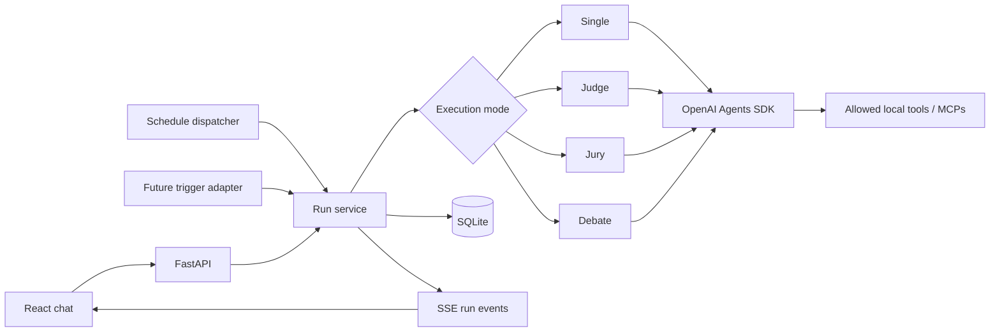

# Raspberry Pi Personal Assistant Chat — Build Plan

## 1. Goal

Build a single-user personal assistant that runs on a Raspberry Pi and can answer questions with an LLM:

- immediately from a chat interface;
- automatically on a one-time, interval, or cron schedule; and
- later, from additional trigger types without rewriting the chat/agent execution path.

The browser UI will be React + Material UI (MUI), built into a Docker image and served by Nginx. The API will be Python + FastAPI, managed with `uv`, and will use the OpenAI Agents SDK for agent runs, tools, MCP servers, streaming, and orchestration. Both application images will be published to Docker Hub and deployable as services in the existing `HomeLab` Portainer stack.

This is intentionally a small, single-device system. Use SQLite and one API process; do not add authentication, Redis, Celery, Kubernetes, multi-tenancy, or horizontal-scaling infrastructure.

## 2. Product scope

### MVP

- Create, rename, list, and delete local conversations.
- Send a prompt and stream its answer.
- Preserve conversation history across restarts.
- Select the default model, execution mode, reasoning effort, local tools, and MCP servers for each run; configure every agent's model individually in multi-agent modes.
- Support four execution modes: `single`, `judge`, `jury`, and `debate`.
- Display run progress, tool activity, final output, errors, duration, and token usage when available.
- Create, enable, disable, edit, run-now, and delete scheduled prompts.
- Recover cleanly after API, container, or Raspberry Pi restarts.
- Expose discovery APIs for models, execution modes, reasoning efforts, tools, and MCP servers.
- Run the complete application with Docker Compose locally and as part of the existing Portainer-managed `HomeLab/docker-compose.yml` stack.
- Build and publish timestamped ARM64 frontend and backend images from GitHub Actions, then update their pinned tags in `HomeLab`.

### Explicit non-goals for the MVP

- User accounts, login, permissions, or multi-user data separation.
- Internet-facing deployment without a separate security layer.
- Distributed workers, high availability, or horizontal scaling.
- Voice input/output, file uploads, semantic search/RAG, and long-term learned memory.
- A UI for installing arbitrary code, arbitrary MCP server URLs, or arbitrary shell commands.
- Mobile apps or push notifications.

These can be added later without changing the core `Trigger -> Run -> Orchestrator -> Result` flow.

## 3. Key design decisions

### 3.1 Separate execution mode from reasoning effort

Use two distinct settings:

- **Execution mode** controls how many agent passes collaborate: `single`, `judge`, `jury`, or `debate`.
- **Reasoning effort** is a model-specific setting such as `low`, `medium`, or `high`. Only offer values supported by each participant's selected model.

Do not call execution modes “reasoning efforts” in code or API schemas; that would make model capability validation ambiguous.

### 3.2 Define the execution modes precisely

| Mode | Behavior | Default model calls | Tool policy |
| --- | --- | ---: | --- |
| `single` | One agent produces the final answer. | 1+ model passes | Selected tools are available. |
| `judge` | A primary agent produces a candidate; a separate judge reviews it and returns the corrected final answer. | 2+ model passes | Tools are available to the primary; the judge receives the candidate and relevant evidence but cannot create duplicate side effects. |
| `jury` | Three independent jurors produce candidates in parallel; a judge compares them and synthesizes the final answer. | 4+ model passes | Only read-only tools may be shared across jurors in the MVP; side-effecting tools are rejected for this mode. |
| `debate` | Multiple debaters propose answers, inspect one another's stated arguments, challenge specific claims, and revise their positions; a moderator then synthesizes the final answer. | 7+ model passes with the default 3 debaters and 2 rounds | Only read-only tools may be used; side-effecting tools are rejected. Tool evidence gathered in the opening round is shared with all participants. |

Make jury size a server-side constrained option with a default of 3 and a small maximum (for example 5). For Debate, require at least 2 debaters and 2 rounds so it cannot degrade into independent voting. Default to 3 debaters and 2 rounds: round 1 produces independent opening positions; round 2 gives every debater the complete public transcript and requires a rebuttal that cites specific competing claims and states whether its answer changed. Then a separate moderator evaluates the transcript and produces the final answer. Bound the MVP to at most 5 debaters and 3 rounds to control latency, token use, and Raspberry Pi concurrency.

The debate transcript contains deliberate, user-visible arguments and evidence, not private chain-of-thought. Prompts must ask for concise claims, supporting evidence, critiques, uncertainty, and revised conclusions; the application must not request or expose hidden reasoning. A participant failure should be recorded and the debate may continue only if at least 2 debaters complete every required round; otherwise fail the run rather than silently falling back to Jury or Single.

### 3.3 Configure multi-agent models individually

Every concrete agent participant has its own `model_id`:

- `single`: one `primary` participant;
- `judge`: `primary` and `judge` participants;
- `jury`: one entry for each `juror_n` plus the final `judge`;
- `debate`: one entry for each `debater_n` plus the final `moderator`.

The run-level model is a convenience default used to initialize newly added participants, not a forced model for all roles. The UI must provide “apply this model to all” for quick setup while still allowing each participant to be changed independently. Different participants may use the same model, and changing jury/debate size adds or removes explicit participant configurations.

Store the effective reasoning effort alongside every participant because reasoning support depends on its model. A participant initially inherits the run-level reasoning effort when supported; otherwise the UI/backend requires a valid value for that model. Model or effort changes must never be silently coerced. The backend validates every participant configuration against the capability registry and snapshots it before execution.

### 3.4 Maintain an application-owned capability registry

Do not expose every provider model or accept arbitrary model/tool names. Keep a server-side registry that defines:

- enabled model IDs and display names;
- supported reasoning efforts and relevant capabilities;
- execution modes and their constraints;
- registered local tools, risk level, and whether they are read-only;
- configured MCP servers and the allowed tools within each server.

The frontend reads this registry through the capability APIs. The backend validates every run again so a crafted request cannot bypass the allowlist.

### 3.5 One execution service for every trigger

Manual chat, schedules, “Run now,” and future triggers must all create the same immutable `RunRequest` and call the same execution service. A trigger decides *when* to create a run, not *how* the agent runs.



### 3.6 Keep local persistence authoritative

SQLite is the source of truth for conversations, messages, schedules, runs, configuration snapshots, and final results. Store provider response/trace IDs only as diagnostic metadata; the application must still work after a restart without relying on provider-hosted conversation state.

Use SQLAlchemy and Alembic rather than creating tables directly. Enable SQLite foreign keys, a busy timeout, and WAL mode. Keep one Uvicorn worker because the in-process scheduler and live event stream assume a single process.

### 3.7 Keep tools safe even without login

“No authentication” does not mean “no security boundary.”

- Configure tools and MCP servers on the server, not in individual request payloads. Requests contain only registered IDs.
- Allowlist individual MCP tools rather than implicitly exposing every tool on a server.
- Mark each tool `read_only` or `side_effecting` and set an approval policy.
- Scheduled runs may use only tools explicitly marked safe for unattended use.
- Default sensitive or side-effecting MCP tools to approval-required and exclude them from unattended runs.
- Do not allow shell execution or arbitrary filesystem access in the MVP.
- Treat MCP output as untrusted content and protect against prompt injection and unsafe returned URLs.
- Keep API keys and MCP credentials in environment variables or Docker secrets; never store or return them through the API.

This matches the Agents SDK model in which the server owns deployment, state, tool implementations, and approval decisions while the SDK owns the agent loop.

### 3.8 Initial local tools

Ship exactly two application-owned tools initially. Both are deterministic, read-only, safe for unattended scheduled runs, and available to every execution mode when the user enables them. Neither requires approval.

#### `current_time`

- Purpose: return the current date and time for an IANA timezone.
- Input: optional `timezone`; default to `APP_TIMEZONE` when omitted.
- Validate requested timezone names against the system/Python timezone database rather than accepting arbitrary strings.
- Output: timezone name, ISO 8601 local datetime with UTC offset, and the corresponding UTC datetime.
- Read the clock when the tool executes; do not let the model invent or cache the time.

#### `calculator`

- Purpose: evaluate bounded basic arithmetic deterministically.
- Input: an arithmetic `expression` and optional supported precision.
- Support numeric literals, parentheses, and an explicit allowlist of basic operators such as `+`, `-`, `*`, `/`, `%`, and exponentiation.
- Parse with a restricted arithmetic parser/AST and decimal-safe numeric handling. Never use Python `eval`, execute code, resolve names, access attributes, import modules, or call arbitrary functions.
- Enforce expression-length, nesting, exponent, magnitude, precision, and execution-time limits; return stable errors for invalid syntax, overflow, or division by zero.
- Output: normalized expression, result, and precision/rounding metadata where relevant.

Register both through the same `ToolDefinition`/registry interface intended for future tools. Adding another tool later should require a new implementation plus registry metadata and tests, without changes to run request schemas or orchestration code. No MCP server is required for these two local tools.

## 4. Proposed technology stack

### Frontend

- React + TypeScript + Vite.
- MUI and MUI Icons.
- React Router for Chat, Automations, and Settings views.
- TanStack Query for API server state.
- A small typed API client generated from FastAPI OpenAPI, or handwritten for the limited MVP surface.
- Markdown rendering with raw HTML disabled and links sanitized.
- Vitest + React Testing Library.
- Multi-stage Docker build; Nginx serves static assets and proxies `/api` to FastAPI.

### Backend

- Python 3.12 or another version confirmed to support the target Pi OS and pinned dependencies.
- FastAPI + Uvicorn, managed with `uv` using `pyproject.toml` and committed `uv.lock`.
- OpenAI Agents SDK (`openai-agents`) with async runs and streaming.
- Pydantic Settings for environment configuration.
- SQLAlchemy 2.x + SQLite/`aiosqlite` + Alembic.
- A lightweight in-process schedule dispatcher using persisted schedule rows, cron parsing, and FastAPI lifespan startup/shutdown.
- Pytest + pytest-asyncio, with a fake agent runner for deterministic tests.
- Ruff and mypy (or Pyright) for code quality.

### Deployment

- Docker Compose with `frontend` and `backend` services for local development.
- Published Docker Hub images for the production `frontend` and `backend` services; Portainer must pull images and must not need the source repository or local build contexts.
- A production service definition maintained in the existing `HomeLab/docker-compose.yml`, following its current environment-variable and pinned-image-tag conventions.
- Named/bind volume for the SQLite database and local application data.
- Explicit ARM64-compatible base images and a build verification on the target Pi architecture.
- Health checks, restart policies, log rotation, and graceful shutdown.
- GitHub Actions publishing modeled on `DnsUpdater/.github/workflows/docker-publish.yml`: Docker Buildx, Docker Hub login, timestamp plus `latest` tags, `linux/arm64`, and a repository dispatch to `tutkowskim/HomeLab`.

## 5. Suggested repository structure

```text
.
├── backend/
│   ├── app/
│   │   ├── api/
│   │   │   ├── routes/
│   │   │   │   ├── capabilities.py
│   │   │   │   ├── conversations.py
│   │   │   │   ├── runs.py
│   │   │   │   ├── schedules.py
│   │   │   │   └── health.py
│   │   │   └── dependencies.py
│   │   ├── agents/
│   │   │   ├── factory.py
│   │   │   ├── orchestrators/
│   │   │   │   ├── base.py
│   │   │   │   ├── single.py
│   │   │   │   ├── judge.py
│   │   │   │   ├── jury.py
│   │   │   │   └── debate.py
│   │   │   ├── prompts.py
│   │   │   └── runner.py
│   │   ├── core/
│   │   │   ├── config.py
│   │   │   ├── capabilities.py
│   │   │   ├── errors.py
│   │   │   └── logging.py
│   │   ├── db/
│   │   │   ├── base.py
│   │   │   ├── models.py
│   │   │   ├── session.py
│   │   │   └── migrations/
│   │   ├── schemas/
│   │   ├── services/
│   │   │   ├── conversations.py
│   │   │   ├── runs.py
│   │   │   ├── run_events.py
│   │   │   └── schedules.py
│   │   ├── tools/
│   │   │   ├── registry.py
│   │   │   ├── local/
│   │   │   └── mcp.py
│   │   ├── triggers/
│   │   │   ├── base.py
│   │   │   ├── manual.py
│   │   │   └── schedule.py
│   │   ├── scheduler.py
│   │   └── main.py
│   ├── tests/
│   ├── Dockerfile
│   ├── pyproject.toml
│   └── uv.lock
├── frontend/
│   ├── src/
│   │   ├── api/
│   │   ├── components/
│   │   ├── features/
│   │   │   ├── chat/
│   │   │   ├── runs/
│   │   │   ├── schedules/
│   │   │   └── settings/
│   │   ├── routes/
│   │   └── main.tsx
│   ├── nginx.conf
│   ├── Dockerfile
│   └── package.json
├── data/                       # ignored; mounted at runtime
├── .github/
│   └── workflows/
│       └── docker-publish.yml
├── compose.yaml
├── .env.example
├── README.md
└── Plan.md
```

Keep orchestration, triggers, and transport/API code separate. In particular, route handlers should validate and delegate; they should not construct agents or execute schedules directly.

## 6. Data model

Use UUIDs (stored as text) and UTC timestamps. Convert schedule times at the API/UI boundary with an explicit IANA timezone.

### `conversations`

- `id`, `title`, `created_at`, `updated_at`, `archived_at`.
- Optional default `model_id`, `execution_mode`, `reasoning_effort`, participant model/effort template, tool IDs, and MCP IDs.

### `messages`

- `id`, `conversation_id`, `role`, `content`, `created_at`.
- `run_id` for assistant messages.
- Keep MVP content text-only, but use an extensible content schema if attachments are likely soon.

### `runs`

- `id`, optional `conversation_id`, optional `schedule_id`.
- `source_type`: `manual`, `schedule`, or future trigger type.
- `status`: `queued`, `running`, `succeeded`, `failed`, `cancelled`, or `awaiting_approval`.
- Immutable snapshot of prompt, default model/effort, execution mode, ordered participant configurations, selected tools/MCPs, jury size, debate participant/round limits, and system prompt version.
- `started_at`, `finished_at`, error code/message, final output.
- Provider response/trace IDs, input/output token counts, and duration when available.

### `run_steps`

- `id`, `run_id`, stable participant ID, role (`primary`, `judge`, `juror_1`, `debater_1`, `moderator`, etc.), effective model ID, reasoning effort, round number where applicable, status, and timestamps.
- Candidate/final text, tool-call summary, token usage, and error details.
- This makes Judge/Jury/Debate progress inspectable without exposing hidden chain-of-thought. Debate step output is the participant's concise public argument or rebuttal.

### `schedules`

- `id`, `name`, prompt, enabled flag, schedule type, schedule expression/config, timezone.
- Snapshot/defaults for conversation, default model/effort, ordered participant model/effort configurations, execution mode, tools/MCPs, jury size, and debate participant/round limits.
- `next_run_at`, `last_run_at`, misfire policy, created/updated timestamps.
- Keep schedules rather than serialized scheduler jobs authoritative so migrations and validation stay under application control.

### `tool_audit_events`

- `id`, `run_id`, step ID, tool/MCP ID, tool name, timestamps, outcome, and redacted argument/result summary.
- Never store secret headers, authorization tokens, or raw sensitive payloads by default.

## 7. API contract

Prefix all endpoints with `/api/v1`. Generate OpenAPI from Pydantic request/response models and use one standard error envelope containing `code`, `message`, and optional safe `details`.

### Discovery/capabilities

- `GET /models` — enabled model IDs, labels, supported reasoning efforts, and relevant feature flags.
- `GET /execution-modes` — `single`, `judge`, `jury`, and `debate`, descriptions, required participant roles, expected call counts, configurable limits, and tool restrictions. Jury/Debate metadata describes dynamic participant roles; Debate metadata includes minimum/default/maximum debaters and rounds.
- `GET /reasoning-efforts?model_id=...` — allowed values for the chosen model.
- `GET /tools` — registered local tools, including initial `current_time` and `calculator` entries, their descriptions/input schemas, enabled state, risk/read-only metadata, and unattended-use policy.
- `GET /mcp-servers` — configured server labels and allowed tools, without URLs containing credentials or any secret values.
- Optionally add `GET /capabilities` as one aggregated bootstrap response to reduce frontend requests; retain the focused endpoints as the public contract.

The model list is a curated registry, not merely a pass-through to the provider’s model-list endpoint, because the app also needs capability and policy metadata.

### Conversations and messages

- `POST /conversations`
- `GET /conversations`
- `GET /conversations/{conversation_id}`
- `PATCH /conversations/{conversation_id}`
- `DELETE /conversations/{conversation_id}`
- `GET /conversations/{conversation_id}/messages`

### Runs

- `POST /conversations/{conversation_id}/runs` — validate options, persist the user message and queued run, then return `202` with the run ID.
- `POST /runs` — execute a standalone prompt used by schedules/future triggers or diagnostic clients.
- `GET /runs/{run_id}` — durable status, steps, final output, usage, and errors.
- `GET /runs/{run_id}/events` — Server-Sent Events (SSE) for status, text deltas, step progress, tool activity, final output, and errors.
- `POST /runs/{run_id}/cancel` — best-effort cancellation.

Run creation accepts an ordered `participants` array. Each item contains a stable participant ID, required role, `model_id`, and `reasoning_effort`. The server derives the permitted role layout from `execution_mode` and participant-count settings; clients cannot invent additional roles. For example:

```json
{
  "execution_mode": "jury",
  "participants": [
    {"id": "juror_1", "role": "juror", "model_id": "<model-a>", "reasoning_effort": "medium"},
    {"id": "juror_2", "role": "juror", "model_id": "<model-b>", "reasoning_effort": "low"},
    {"id": "juror_3", "role": "juror", "model_id": "<model-c>", "reasoning_effort": "high"},
    {"id": "judge", "role": "judge", "model_id": "<model-d>", "reasoning_effort": "high"}
  ]
}
```

Return the resolved participant configuration from `GET /runs/{run_id}` so the UI and audit history show which model actually handled each role.

Suggested SSE event types: `snapshot`, `run.status`, `step.started`, `text.delta`, `tool.started`, `tool.completed`, `step.completed`, `run.completed`, `run.failed`, and heartbeat comments. Persist status milestones and final content, but do not write every token delta to the Pi’s storage. On reconnect, send a current snapshot; completed output is always recoverable through `GET /runs/{id}`.

### Schedules

- `POST /schedules`
- `GET /schedules`
- `GET /schedules/{schedule_id}`
- `PATCH /schedules/{schedule_id}`
- `DELETE /schedules/{schedule_id}`
- `POST /schedules/{schedule_id}/run-now`
- `GET /schedules/{schedule_id}/runs`

Support `once`, `interval`, and `cron` schedule types. Validate expressions before storing them and return both the next UTC execution and its localized display value.

### Operations

- `GET /health/live` — process is alive.
- `GET /health/ready` — database is accessible, migrations are current, and required configuration is valid. Do not make a paid OpenAI request from a health check.

## 8. Backend execution flow

1. Validate the request and every participant's model/effort pair against the model/tool/MCP/mode registries.
2. Resolve conversation defaults and request overrides into an immutable run configuration with the exact required participant roles and cardinality.
3. Reject incompatible combinations (for example, Jury or Debate plus a side-effecting tool, or Debate with fewer than 2 participants/rounds).
4. Persist the user message and a `queued` run before starting model work.
5. Start the run asynchronously and immediately return its ID.
6. Build bounded conversation context from local messages. Add a summarization/compaction policy later when histories become too large.
7. Construct only the tools and MCP servers selected for this run.
8. Delegate to the selected orchestrator.
9. Stream safe progress events; do not expose private chain-of-thought. Show role/status, candidate answers when desired, tool calls, and the final answer.
10. Persist each step, final assistant message, usage, and terminal status in a transactionally consistent order.
11. On failure, retain a stable error code and safe message, then permit a manual retry that creates a new run linked to the failed run.

Use dependency injection around the Agents SDK runner so tests can provide a deterministic fake and orchestration code does not depend directly on network calls.

## 9. Scheduling and future triggers

### MVP scheduler behavior

- Run a lightweight dispatcher in FastAPI lifespan with an explicit singleton guard and one Uvicorn worker.
- Store all schedules and `next_run_at` values in SQLite; do not rely only on in-memory scheduler state.
- Atomically claim due schedules to prevent duplicate runs.
- Recalculate `next_run_at` before launching work so a failed model call does not cause a tight retry loop.
- Define a misfire policy: default to `run_once` after a short outage, with `skip` available per schedule.
- Mark interrupted `running` runs as failed/recoverable during startup; never silently report them as successful.
- Use the configured schedule timezone for cron interpretation and store actual instants in UTC.
- Limit concurrent model runs with a small semaphore appropriate for the Pi and API rate limits.

### Extension point

Define a small trigger interface such as:

```python
class Trigger(Protocol):
    type: str

    async def validate(self, config: dict) -> None: ...
    async def create_run_request(self, event: TriggerEvent) -> RunRequest: ...
```

Future webhook, filesystem, email, GPIO, MQTT, or Home Assistant adapters translate their event into `TriggerEvent` and then use the same run service. They must not call the Agents SDK directly.

## 10. Frontend experience

### App shell

- Responsive MUI layout suitable for desktop and a small tablet display.
- Left navigation: conversations, New Chat, Automations, Settings.
- Main area: message thread, run progress, and composer.

### Chat

- Stream Markdown output with a visible stop button.
- Composer settings drawer for default model, execution mode, default reasoning effort, tools, and MCP servers.
- For multi-agent modes, render one model selector per concrete participant (`primary`/`judge`, each juror plus judge, or each debater plus moderator), with an adjacent reasoning-effort selector filtered for that model.
- Provide “apply model to all” and “apply reasoning effort where supported” actions without removing individual overrides.
- Disable or explain invalid combinations immediately based on capability metadata.
- Show the estimated mode multiplier (“1 agent,” “2 passes,” “3 jurors + judge,” or “3 debaters × 2 rounds + moderator”) and participant/model summary before execution.
- Render Judge/Jury progress as compact step states. Render Debate as rounds containing labeled, concise public arguments and rebuttals followed by the moderator's synthesis; never label or present these as private chain-of-thought.
- Allow retry and “reuse these settings.”

### Automations

- List schedules with enabled state, next run, last result, and timezone.
- Editor for once/interval/cron, prompt, target conversation, mode, every participant's model/reasoning configuration, and allowed tools.
- Provide readable presets in addition to raw cron input.
- Include Run Now and recent run history.

### Settings/status

- Read-only display of backend health, configured models, available tools/MCPs, database path, application version, and timezone.
- Never send API keys or connector secrets to the browser.

## 11. Nginx, Docker, Portainer, and image publishing

### Application containers

- Frontend Dockerfile: Node build stage followed by a small pinned Nginx runtime image.
- Backend Dockerfile: install dependencies from the locked `uv` environment, run as a non-root user, and include a health check.
- Nginx should serve `index.html` as the SPA fallback and cache hashed assets aggressively.
- Proxy `/api/` to the backend; disable response buffering and extend read timeouts for SSE.
- Compose should persist `/app/data`, inject configuration, declare service health dependencies, and use `restart: unless-stopped`.
- Bind to the Pi’s LAN only if remote devices need access. Otherwise bind to loopback. With no authentication, do not forward the port from the router to the public internet.
- Pin image/dependency versions and confirm all images support the Pi’s architecture (`linux/arm64` for a 64-bit Pi OS).
- Document database backup and restore. Prefer an SSD or high-endurance storage if run history will be write-heavy.

### Portainer/HomeLab integration

Treat `HomeLab/docker-compose.yml` as the authoritative production stack definition and this repository’s `compose.yaml` as the local-development definition. Do not add `build:` entries to the HomeLab stack; it should pull published images.

Add two services to the HomeLab stack:

- `chat_backend` using `tutkowskim/chat-backend:<pinned timestamp tag>`;
- `chat_frontend` using `tutkowskim/chat-frontend:<same pinned timestamp tag>`.

The backend service should:

- receive `${CHAT_OPENAI_API_KEY}`, `${CHAT_TIMEZONE}`, and any MCP credentials from Portainer stack environment variables;
- mount a named `chat_data` volume at `/app/data` for SQLite and application data;
- use `restart: unless-stopped`, a health check, and no host-published port;
- have an internal service name that the frontend Nginx config can resolve.

The frontend service should:

- proxy `/api/` to `http://chat_backend:<internal port>`;
- expose no host port when it is routed through the HomeLab `nginx-proxy` service;
- use `restart: unless-stopped` and a health check;
- depend on the backend health where supported by the Portainer/Docker Compose version.

Extend the existing HomeLab `nginx_config` with a `chat.tutkowski.com` server block. That outer proxy routes to `chat_frontend:80`; the frontend’s own Nginx routes API and SSE traffic internally to the backend. Apply the same SSE buffering/time-out settings at both proxy layers.

Continue the HomeLab convention of pinning timestamped tags rather than deploying `latest`. Portainer polls the HomeLab Git repository every five minutes, detects the committed tag update, pulls the new pinned images, and redeploys the stack. No Portainer webhook or direct deployment call is needed from this repository’s release workflow.

### GitHub Actions publishing workflow

Create `.github/workflows/docker-publish.yml`, triggered by every push to `main` and based on the working DnsUpdater workflow, with these jobs:

1. **Test** — run backend and frontend checks before publishing.
2. **Prepare** — generate one UTC tag such as `2026.08.11.2140` and expose it as a job output so both images receive exactly the same release tag.
3. **Build/push backend** — build `./backend` for `linux/arm64` only and push `tutkowskim/chat-backend:<tag>` plus `:latest`.
4. **Build/push frontend** — build `./frontend` for `linux/arm64` only and push `tutkowskim/chat-frontend:<tag>` plus `:latest`.
5. **Notify HomeLab** — only after both image jobs succeed, send one authenticated `repository_dispatch` event containing the shared tag and both image names.

Use the same repository secrets as DnsUpdater unless renamed:

- `DOCKERHUB_USERNAME`
- `DOCKERHUB_TOKEN`
- `PERSONAL_ACCESS_TOKEN` with only the access needed to dispatch to `tutkowskim/HomeLab`

Also set minimal workflow permissions, use Buildx cache storage, attach the commit SHA as an OCI image label, and ensure forks/pull requests cannot publish images or access publishing secrets.

The current HomeLab `update-service-image-tag.yml` accepts only one image per event. Extend it to accept an `images` object/list and update both chat image lines in one workflow run and one commit. Preserve support for the existing single-image `image_name`/`new_tag` payload so DnsUpdater and other publishers keep working. A single atomic update avoids two repository-dispatch workflows racing to commit separate frontend/backend changes.

Recommended dispatch payload shape:

```json
{
  "event_type": "update-docker-tags",
  "client_payload": {
    "tag": "2026.08.11.2140",
    "images": [
      "tutkowskim/chat-backend",
      "tutkowskim/chat-frontend"
    ]
  }
}
```

Validate image names and tag formats in the HomeLab workflow before editing YAML. Configure workflow concurrency for HomeLab tag updates and pull/rebase before committing so unrelated publisher events do not lose changes.

## 12. Configuration

Provide `.env.example` with non-secret defaults and documentation for at least:

- `OPENAI_API_KEY`
- `APP_DATA_DIR`
- `DATABASE_URL`
- `APP_TIMEZONE`
- `ALLOWED_ORIGINS`
- `MODEL_REGISTRY` or a path to a versioned YAML/JSON registry
- `DEFAULT_MODEL_ID`
- `DEFAULT_EXECUTION_MODE`
- `DEFAULT_REASONING_EFFORT`
- `MAX_CONCURRENT_RUNS`
- `MAX_JURY_SIZE`
- `DEFAULT_DEBATE_PARTICIPANTS` and `MAX_DEBATE_PARTICIPANTS`
- `DEFAULT_DEBATE_ROUNDS` and `MAX_DEBATE_ROUNDS`
- MCP credential environment variables referenced by server-side MCP configuration
- log level and whether prompt/tool payload logging is enabled (default off)

Validate configuration at startup and fail with a clear error when a required secret or default capability is missing.

## 13. Delivery phases

### Phase 0 — Confirm decisions and scaffold

- [ ] Resolve the open questions in section 16.
- [ ] Create backend and frontend projects.
- [ ] Configure `uv`, TypeScript, formatting, linting, tests, environment settings, and `.gitignore`.
- [ ] Add Dockerfiles, Compose, Nginx proxying, and health endpoints.
- [ ] Add the GitHub Actions test/build/publish workflow using the DnsUpdater conventions.
- [ ] Draft the two production services and reverse-proxy route for the HomeLab Portainer stack.
- [ ] Verify a no-op stack on the target Pi architecture.

**Exit:** React loads through Nginx, FastAPI health is reachable through `/api`, SQLite persists across container restarts, and checks run locally.

### Phase 1 — Single-mode chat vertical slice

- [ ] Add migrations and conversation/message/run models.
- [ ] Add the model and reasoning capability registries/APIs.
- [ ] Wrap the Agents SDK behind `AgentRunner`.
- [ ] Implement `single` orchestration and persisted run states.
- [ ] Implement SSE events and the React chat UI.
- [ ] Add cancellation, stable error handling, usage metadata, and retries.

**Exit:** A user can hold a persisted, streaming conversation, select a supported model/reasoning effort, survive a page refresh, and inspect failed runs.

### Phase 2 — Tools and MCP selection

- [ ] Add tool and MCP registries plus discovery APIs.
- [ ] Map selected IDs to SDK tool/MCP objects only after policy validation.
- [ ] Add read-only/side-effect/unattended metadata and audit events.
- [ ] Add frontend selectors and tool progress displays.
- [ ] Implement `current_time` with validated IANA timezones and `APP_TIMEZONE` fallback.
- [ ] Implement `calculator` with a restricted arithmetic parser, deterministic numeric behavior, and resource bounds; explicitly prohibit `eval` or arbitrary code execution.
- [ ] Mark both tools read-only, approval-free, and safe for unattended scheduled and multi-agent runs.

**Exit:** A run can use only explicitly selected, registered tools; `current_time` and `calculator` work across manual, scheduled, and multi-agent runs; secrets stay server-side; disallowed and incompatible selections fail before the model call.

### Phase 3 — Judge, Jury, and Debate orchestration

- [ ] Add versioned prompts and structured outputs for candidate review/synthesis.
- [ ] Add ordered participant configuration schemas and per-participant Agents SDK construction for all multi-agent modes.
- [ ] Implement Judge with a tool-free reviewer/finalizer.
- [ ] Implement Jury with bounded parallel jurors and a final judge.
- [ ] Implement Debate with bounded participants, ordered rounds, shared public transcripts, required claim-specific rebuttals, position revision, and a final moderator.
- [ ] Enforce Debate quorum and partial-failure rules, plus read-only tool and shared-evidence policies.
- [ ] Persist/run-stream each role’s status and usage.
- [ ] Add limits, cancellation propagation, partial-failure behavior, and frontend cost/latency warnings.

**Exit:** All four execution modes have deterministic orchestration tests, visible progress, one persisted final answer, and enforced side-effect restrictions. Debate tests prove that each surviving participant receives prior-round arguments and produces a rebuttal before moderation.

### Phase 4 — Scheduled runs

- [ ] Add schedule schema, migrations, CRUD APIs, and Automations UI.
- [ ] Implement once, interval, cron, timezone, enable/disable, run-now, and misfire behavior.
- [ ] Add atomic due-work claiming, concurrency limits, restart reconciliation, and unattended tool policy.
- [ ] Add schedule history and next-run previews.

**Exit:** A scheduled prompt runs once at the expected time, produces the same run records as a manual prompt, and behaves predictably across a container restart.

### Phase 5 — Raspberry Pi hardening and release

- [ ] Test native ARM64 builds and measure idle/active CPU and memory.
- [ ] Publish matching timestamped frontend/backend images to Docker Hub and verify their ARM64 manifests.
- [ ] Extend the HomeLab repository-dispatch workflow for an atomic two-image tag update while retaining its existing single-image payload.
- [ ] Add the pinned chat services, persistent volume, environment variables, and assistant proxy route to `HomeLab/docker-compose.yml`.
- [ ] Deploy through Portainer, confirm image pulls and volume persistence, and document the update/rollback procedure.
- [ ] Verify Nginx SSE settings and graceful shutdown during a live run.
- [ ] Add log rotation, health checks, database backup/restore, and startup migration documentation.
- [ ] Add LAN exposure guidance and confirm secrets are absent from images, frontend bundles, API responses, and logs.
- [ ] Run unit, integration, frontend, Compose smoke, and one opt-in live OpenAI test.

**Exit:** A fresh Pi can be configured from `.env.example`, started with one documented command, rebooted without data loss, and restored from backup.

## 14. Test strategy

### Backend unit tests

- Capability validation and default resolution.
- Single/Judge/Jury/Debate call order, per-participant model/effort selection, inputs, results, concurrency, and cancellation using a fake runner.
- Required-role/cardinality validation, unsupported per-model reasoning efforts, participant add/remove behavior, and immutable configuration snapshots.
- Debate transcript propagation, minimum participants/rounds, claim-specific rebuttal validation, quorum loss, moderator inputs, and call-count limits.
- Tool/MCP allowlisting and unattended/side-effect policies.
- `current_time` default/explicit timezone handling, UTC conversion, and invalid timezone errors using a frozen test clock.
- `calculator` operator precedence, decimal behavior, invalid syntax, division by zero, and every resource/syntax restriction, including tests proving names, calls, attributes, imports, and code execution are rejected.
- Schedule calculations across timezones and daylight-saving transitions.
- Misfire, restart recovery, duplicate-claim, and partial-failure behavior.

### Backend integration tests

- API contracts against a temporary SQLite database with migrations applied.
- Conversation/run/message transaction boundaries.
- SSE event sequence and disconnect behavior.
- Schedule CRUD and run-now paths.
- Agents SDK adapter tested with mocked network responses; one live test is opt-in and excluded from normal CI.

### Frontend tests

- Capability-dependent per-participant model/reasoning selectors, apply-to-all behavior, and invalid-combination messaging.
- Chat streaming, errors, cancellation, and reload behavior.
- Judge/Jury step progress and Debate round/transcript progress.
- Schedule forms, timezone display, and next-run previews.

### Deployment tests

- Build both images for ARM64.
- Start Compose, wait for readiness, open the SPA, call the API through Nginx, and verify SSE is not buffered.
- Restart backend and the full stack, confirming conversation/schedule persistence and scheduler reconciliation.

## 15. MVP acceptance criteria

- The app starts on a 64-bit Raspberry Pi with Docker Compose and no manual database setup.
- The same published images run as part of the existing HomeLab Portainer stack without building source code on the Pi.
- The UI is React + MUI and is served by Nginx.
- The backend is FastAPI, dependencies are locked and installed with `uv`, and agent work uses the OpenAI Agents SDK.
- Model, execution mode, reasoning effort, tool, and MCP choices are populated from backend discovery APIs and validated server-side.
- In Judge, Jury, and Debate, the user can select a model individually for every agent and final judge/moderator; the effective model and compatible reasoning effort are persisted and used for that participant.
- The initial `current_time` and `calculator` tools are discoverable, individually selectable, usable in scheduled and multi-agent runs, and cannot mutate data or execute arbitrary code.
- Single, Judge, Jury, and Debate return one clear final answer and show understandable progress.
- Debate always includes at least 2 agents completing at least 2 rounds of visible argument and rebuttal before an independent moderator synthesizes the answer; it never silently behaves like Jury or Single.
- Chat history, schedules, run status, and final outputs survive refreshes and restarts.
- One-time, interval, and cron schedules execute in the configured timezone without duplicate runs.
- Scheduled runs and future triggers use the same execution service as manual chat.
- Secrets never appear in the frontend bundle, discovery responses, or normal logs.
- The app is not publicly exposed by default and documents the risk of running without authentication.
- Automated tests cover orchestration policy, schedule/restart behavior, API contracts, and the main frontend flow.
- A push to `main` runs tests, publishes matching timestamped ARM64 frontend/backend tags plus `latest`, and atomically updates the pinned tags in HomeLab only after both image builds succeed.
- The previous timestamped image pair remains available for a simple HomeLab tag rollback.

## 16. Decisions

### Confirmed deployment decisions

- Docker Hub images: `tutkowskim/chat-backend` and `tutkowskim/chat-frontend`.
- Public HomeLab hostname: `chat.tutkowski.com`.
- Published platform: `linux/arm64` only.
- Release trigger: every push to `main` after required tests pass.
- Deployment trigger: the publishing workflow updates the pinned tags in HomeLab; Portainer polls that Git repository every five minutes and redeploys without a webhook.

### Confirmed product decisions

- Multi-agent modes allow an individual model choice for every participant, including the final judge or moderator.
- The initial tool set is `current_time` and `calculator`; both are local, read-only, approval-free, and allowed in unattended runs. Additional tools will use the same registry extension point later.

### Decisions still to confirm before implementation

1. **Pi hardware and OS:** Which Raspberry Pi model, RAM size, 32/64-bit OS, and storage will be used? The recommended baseline is a 64-bit OS and SSD/high-endurance storage.
2. **Network exposure:** Will the UI be available only on the Pi, or to other devices on the home LAN? No-auth deployment is reasonable on a trusted LAN but should not be internet-facing.
3. **Judge/Jury/Debate semantics:** Is the proposed behavior correct: Judge = draft plus independent reviewer/finalizer; Jury = three independent drafts plus a final judge; Debate = three debaters completing an opening and rebuttal round plus a final moderator?
4. **Schedule behavior:** Are once, interval, and cron schedules sufficient? What should happen after downtime: run one missed occurrence (recommended) or skip all missed occurrences?
5. **Conversation memory:** Should every scheduled run append to a selected conversation, create a new conversation, or default to a standalone run? The proposed design supports all three, but the UI needs a default.
6. **Notifications:** Is saving scheduled answers in the UI enough, or should completion/error notifications (email, push, Slack, etc.) be part of the first release?
7. **Data retention:** Should conversations and tool audit records be kept indefinitely, or should the app automatically prune old run details?

## 17. Reference

- [OpenAI Agents SDK guide](https://developers.openai.com/api/docs/guides/agents#build-with-the-sdk)
- [OpenAI MCP and connectors guide](https://developers.openai.com/api/docs/guides/tools-connectors-mcp)
